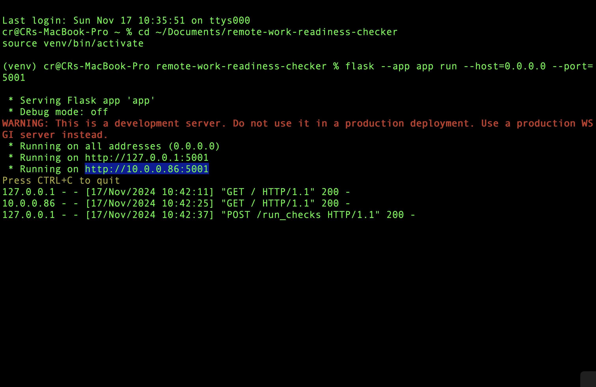
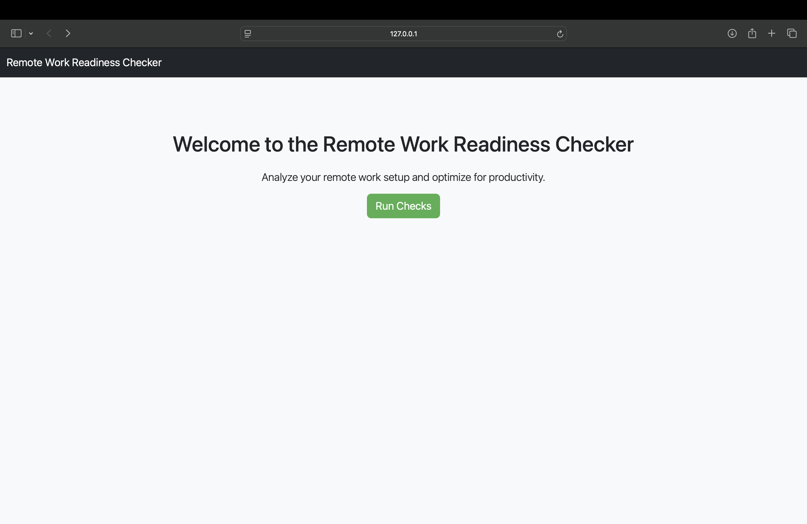
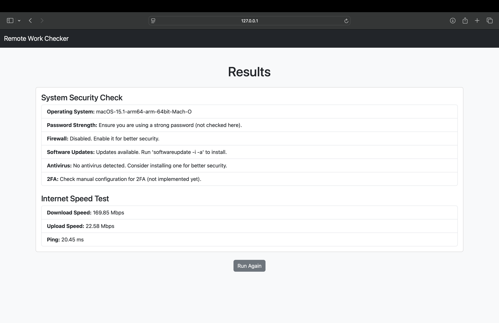
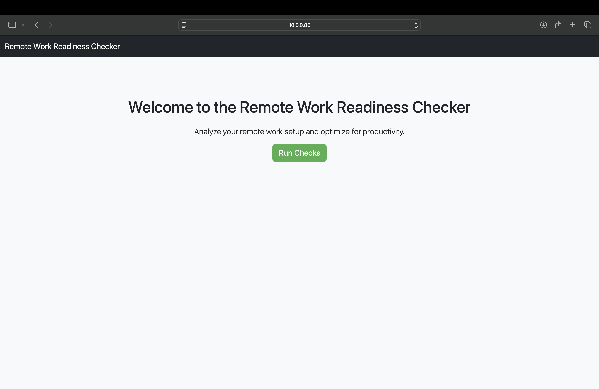
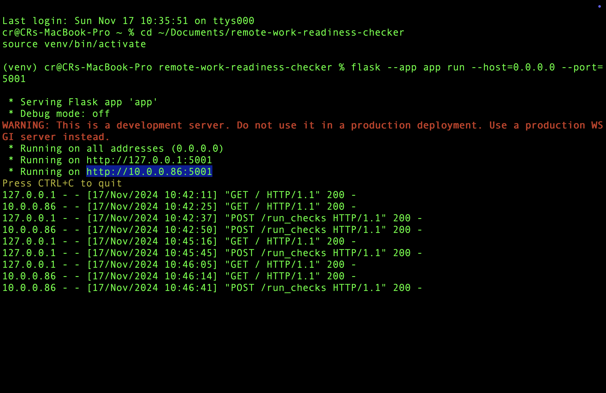
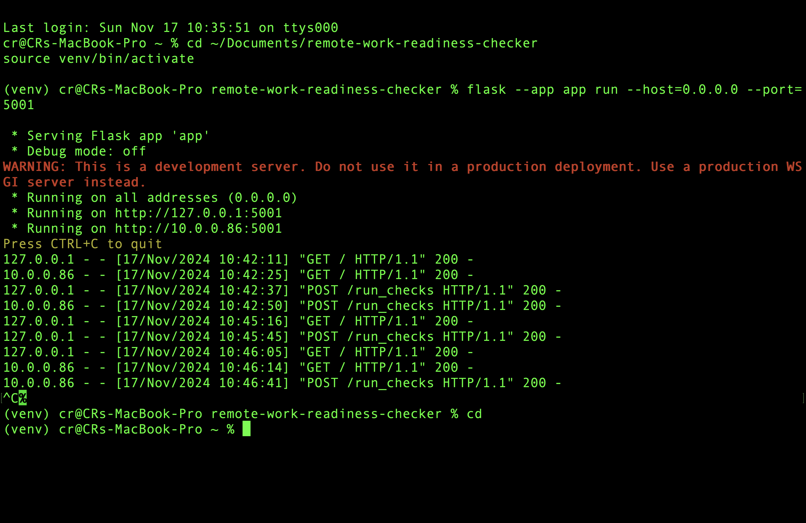

# Remote Work Readiness Checker

## Overview

This tool helps users evaluate their remote work setup for productivity and security. It runs system checks for firewall status, antivirus software, software updates, and internet speed (download/upload speeds, ping), and presents results with actionable recommendations.

## Features

- **System Security Check**
  - Operating System
  - Password Strength
  - Firewall Status
  - Software Updates
  - Antivirus Check
  - 2FA (Two-Factor Authentication) Configuration Check

- **Internet Speed Test**
  - Download Speed
  - Upload Speed
  - Ping
  
## Screenshots

Here are a few key screenshots of the app in action:

### 1. Welcome Page

This is the initial landing page of the app, where users can click "Run Checks" to begin the evaluation.

  
*Figure 1: Welcome page of the Remote Work Readiness Checker.*

### 2. Results Overview

Once the checks are completed, users will see a summary of the results, including their operating system info, password strength, firewall status, software updates, and more.

  
*Figure 2: The results summary after running the checks.*

### 3. Detailed Results

This screenshot shows the detailed results, including specific recommendations such as enabling a firewall, updating software, and installing antivirus software.

  
*Figure 3: Detailed breakdown of system and internet performance checks.*

### 4. Running the App on Localhost

The server can be accessed locally at `http://127.0.0.1:5000/` and the remote device at `http://10.0.0.86:5001/`.

  
*Figure 4: Flask server running on localhost and remote address.*

### 5. Running Internet Speed Tests

After pressing "Run Checks," the internet speed tests are displayed, showcasing the download and upload speeds, as well as ping.

  
*Figure 5: Internet speed test results including download/upload speed and ping.*

### 6. Checking Error for Port 5000

In case of the "Port 5000 is in use" error, ensure that the AirPlay Receiver service is turned off. Below, the error message and a solution are displayed.

  
*Figure 6: Error message related to port 5000 being in use.*

### 7. Disabling AirPlay Receiver

Here’s how to turn off the AirPlay Receiver service, which may be occupying port 5000 and causing the "Port in Use" error.

  
*Figure 7: Instructions to disable AirPlay Receiver on macOS.*

## Usage

### Requirements

- macOS, Windows, or Linux (Python 3.8 or higher)
- Flask (`pip install flask`)
- Speedtest-cli (`pip install speedtest-cli`)

### Starting the Server

To run the tool locally, use the following command in your terminal (assuming you're in the project directory and have the virtual environment activated):

```bash
flask --app app run --host=0.0.0.0 --port=5000
```

If you experience a conflict with port 5000 being used by another application (e.g., AirPlay Receiver), you can change the port number:

```bash
flask --app app run --host=0.0.0.0 --port=5001
```

### Running the Checks

1. Open your browser and navigate to `http://127.0.0.1:5000/` (or the remote address `http://<your IP>:5000/`).
2. Click **Run Checks** to begin the system analysis.
3. Review the results displayed after the checks are complete.

### Notes

- **Port 5000 Occupied**: If you encounter the error "Port 5000 is in use," it may be due to the AirPlay Receiver service being active on macOS. To resolve:
  - Go to **System Preferences** → **General** → **AirDrop & Handoff**.
  - Disable the **AirPlay Receiver** service.
  
    
  *Figure 7: Instructions to disable AirPlay Receiver.*

## Troubleshooting

### Error: Port 5000 is in Use

If you see the error that Port 5000 is occupied by another program, use the following steps to find and stop the service using that port:

1. Find the process using port 5000:

   ```bash
   lsof -i :5000
   ```

2. Kill the process:

   ```bash
   kill -9 <PID>
   ```

3. Restart the Flask server with:

   ```bash
   flask --app app run --host=0.0.0.0 --port=5000
   ```
   
